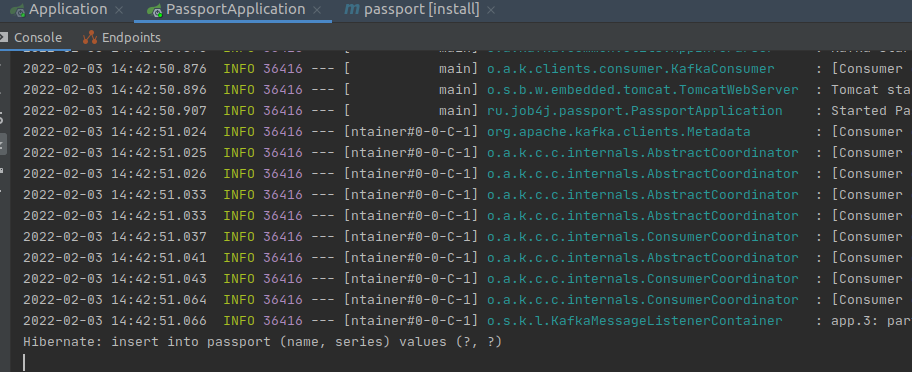

# Publisher-Subscriber Kafka

## О проекте
#### Описание
Тестовое задание.
Демонстрирует взаимодействие двух микросервисов через брокер сообщений Kafka.
Микросервис Application не работает с БД, а лишь получает запросы пользователя, и публикует сообщение
в Kafka. Микросервис PassportApplication получает сообщения от Kafka и сохраняет полученные объекты в БД.

#### Общая схема взаимодействия
Пользователь отправляет форму с некого приложения *Application* через Post-запрос. 
В данной форме заполняются поля модели Passport. 
Затем происходит сериализация объекта Passport и отправка сообщения в сторону Kafka.
При этом в сообщении мы передаем сериализованный объект Passport. 
Затем приложение PassportApplication, которое является subscriber'ом получает сообщение,
десериализует объект и сохраняет его в БД.

Непосредственно запрос от пользователя в приложении Application

Лог работы publisher'a (микросервис Application)

На стороне subscriber'a слушатель ловит полученный объект и десериализует его, а затем сохраняет в БД.

 
 
 
 
 #### Примечание 
 Намеренно упростил модель данных, а также убрал тесты.
 Небольшие сложности возникли с настройкой сериализации и десериализации при передачи объекта, 
 так как в предыдущем проекте брокеру передавалась обычная строка.
 
 
 
 
 

 
